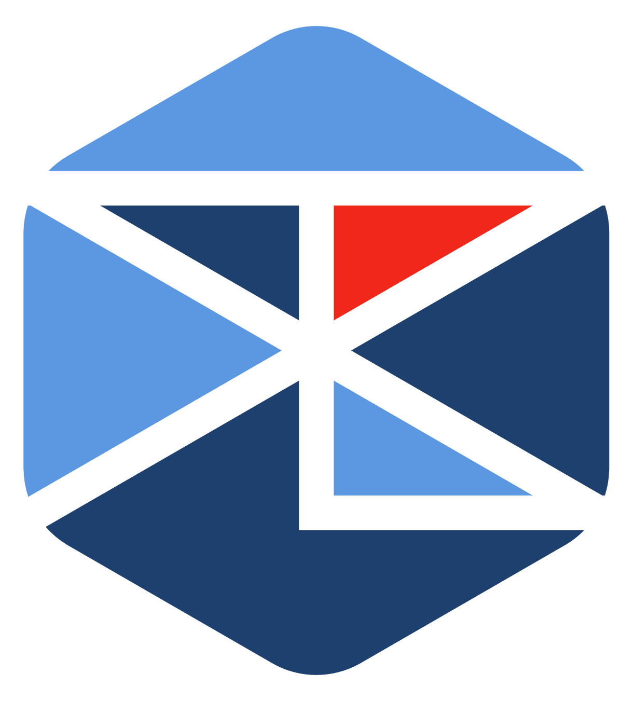

<section align="center">
  
  

    <h1>Aplikasi Judgels</h1>
    
<strong>Projek Akhir Praktikum Komunikasi Data dan Jaringan Komputer</strong> 
    Departemen Ilmu Komputer - IPB University 
    Target Deployment: <a href="http://103.160.213.105"><code>http://103.160.213.105</code></a> (<code>cp.codetoday</code>)

    
Disusun oleh:

    <table align="center" style="margin-top: 1rem; text-align: left; border-collapse: collapse;">
      <tr>
        <th style="padding: 6px 16px; border: 1px solid #444;">Nama</th>
        <th style="padding: 6px 16px; border: 1px solid #444;">NIM</th>
      </tr>
      <tr>
        <td style="padding: 6px 16px; border: 1px solid #444;"><strong>Mochamad Aleandre Moulidouane</strong></td>
        <td style="padding: 6px 16px; border: 1px solid #444;"><code>M0403241105</code></td>
      </tr>
      <tr>
        <td style="padding: 6px 16px; border: 1px solid #444;"><strong>Rafael Federico Atantya</strong></td>
        <td style="padding: 6px 16px; border: 1px solid #444;"><code>M0403241108</code></td>
      </tr>
      <tr>
        <td style="padding: 6px 16px; border: 1px solid #444;"><strong>Aditya Cahyo Nugroho</strong></td>
        <td style="padding: 6px 16px; border: 1px solid #444;"><code>M0403241109</code></td>
      </tr>
      <tr>
        <td style="padding: 6px 16px; border: 1px solid #444;"><strong>Ahmad Rafif Ilmany</strong></td>
        <td style="padding: 6px 16px; border: 1px solid #444;"><code>M0403241090</code></td>
      </tr>
    </table>
  

   
  <nav aria-label="Navigation">
    <a href="#sekilas-tentang">Sekilas Tentang</a> |
    <a href="#perbandingan-judgels-dengan-aplikasi-sejenis">Perbandingan</a>
  </nav>
</section>

---

## Sekilas Tentang

**Judgels** adalah platform *open-source* untuk pengelolaan kontes pemrograman kompetitif (*competitive programming*) dan pelatihan daring (*training camp*). Dikembangkan secara aktif oleh **Ikatan Alumni Tim Olimpiade Komputer Indonesia (IA-TOKI)**, platform ini menjadi fondasi utama sistem penjurian nasional di Indonesia, termasuk **TLX TOKI**, Olimpiade Sains Nasional (OSN) bidang Informatika, hingga seleksi Pelatnas Tim Olimpiade Komputer Indonesia menuju IOI.

Berbeda dari sistem berbasis monolitik konvensional, Judgels dirancang menggunakan arsitektur layanan terdistribusi (*distributed services*) untuk memastikan isolasi keamanan dan skalabilitas beban saat melayani ratusan pengiriman program secara serentak.

### Ringkasan Cepat (Executive Summary)

- **Definisi:** Platform *online judge* dan sistem manajemen kontes pemrograman *open-source* berbasis layanan terdistribusi.
- **Implementasi Nyata:** Mesin utama di balik platform **TLX TOKI** dan Olimpiade Sains Nasional (OSN) Informatika.
- **Fungsi Pokok:** Pengelolaan bank soal, penerimaan solusi peserta, eksekusi kode terisolasi (*sandbox*), penilaian otomatis (*verdict* AC/WA/TLE), dan papan skor waktu nyata (*live scoreboard*).
- **Arsitektur:** Terdiri dari antarmuka web peserta (**Judgels Client - React SPA**), layanan backend & panel juri (**Judgels Server - Java**), pekerja penilai (**Judgels Grader - Java Worker**), antrean tugas (**RabbitMQ**), serta basis data relasional (**MySQL**).
- **Format Penilaian:** Mendukung penuh format **IOI** (dengan pembobotan subtask dan skor parsial) serta format **ICPC** (penalti waktu dan skor penuh).

---

## Perbandingan Judgels dengan Aplikasi Sejenis

| Aspek | Judgels | DOMjudge | CMS (Contest Management System) | DMOJ |
|---|---|---|---|---|
| **Pengembang** | Ikatan Alumni TOKI | Komunitas DOMjudge | Komunitas CMS | Komunitas DMOJ |
| **Konsep Utama** | Sistem pengelolaan soal dan kontes pemrograman | Sistem penjurian kontes pemrograman, terutama bergaya ICPC | Sistem terdistribusi untuk menyelenggarakan kontes pemrograman, terutama bergaya IOI | *Online judge* sekaligus platform kontes dan arsip soal |
| **Model Deployment** | *Self-hosted*; tersedia image Docker dan skrip Ansible | *Self-hosted*; server kontes dan satu atau lebih *judgehost* | *Self-hosted* di Linux; tersedia opsi Docker | *Self-hosted*; situs dan server penjurian dipasang sebagai komponen terpisah |
| **Jenis Soal** | *Batch*, interaktif, *output-only*, dan *functional/grader*; mendukung subtask | Penjurian otomatis dengan bahasa dan validator yang dapat dikonfigurasi | Beragam jenis tugas, termasuk *batch*, *output-only*, dan interaktif | Soal berbasis input/output, interaktif, dan *signature-graded*; mendukung validator khusus |
| **Format Kontes** | IOI dan ICPC; mendukung kontes virtual | ICPC dan penilaian parsial bergaya IOI | Beragam format tugas dan penilaian; dirancang untuk kebutuhan IOI | ICPC, IOI, AtCoder, dan ECOO; mendukung partisipasi virtual |
| **Fitur Pengelolaan** | Versi soal, pengumuman, klarifikasi, papan skor, serta peran pengelola dan pengawas | Antarmuka juri dan tim, klarifikasi, papan skor, serta penjurian ulang | Antarmuka administrasi, impor kontes dan soal, serta layanan papan skor | Arsip soal, editorial, papan skor, rating opsional, dan pengelolaan pengguna |
| **Skalabilitas** | Bergantung pada kapasitas dan konfigurasi deployment | Kapasitas penjurian dapat ditambah dengan *judgehost* | Arsitektur terdistribusi dengan layanan dan pekerja penjurian | Mendukung banyak server penjurian |
| **Kebutuhan Pengelolaan** | Administrator menyiapkan dan memelihara deployment serta server | Administrator menyiapkan server kontes, basis data, dan *judgehost* | Administrator menyiapkan layanan CMS, PostgreSQL, dan lingkungan penjurian | Administrator menyiapkan situs, basis data, dan server penjurian |
| **Biaya Perangkat Lunak** | Open Source, GPL-2.0; tetap memerlukan biaya infrastruktur | Open Source; tetap memerlukan biaya infrastruktur | Open Source; tetap memerlukan biaya infrastruktur | Open Source, AGPL-3.0; tetap memerlukan biaya infrastruktur |

Judgels cocok bila dibutuhkan pengelolaan soal yang kaya fitur sekaligus kontes IOI dan ICPC. DOMjudge kuat untuk operasional kontes ICPC, CMS untuk kebutuhan olimpiade bergaya IOI, sedangkan DMOJ menggabungkan kontes dengan situs latihan dan arsip soal. Perbandingan ini didasarkan pada dokumentasi resmi Judgels, DOMjudge, CMS, dan DMOJ.
